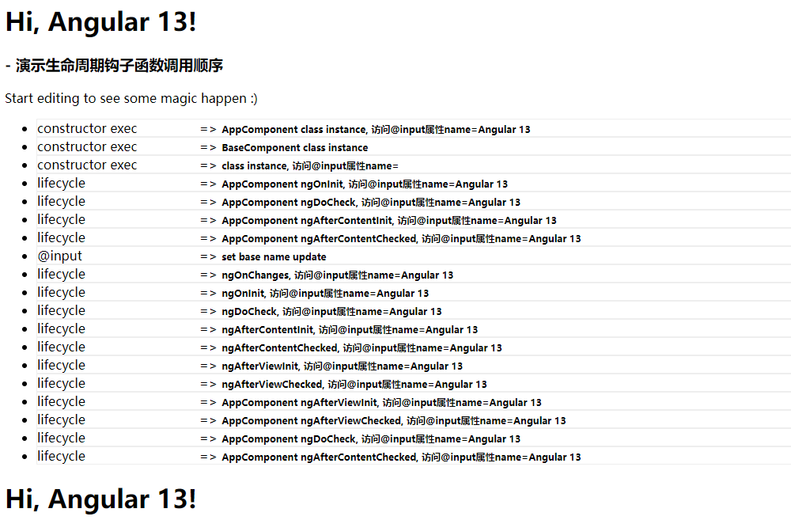
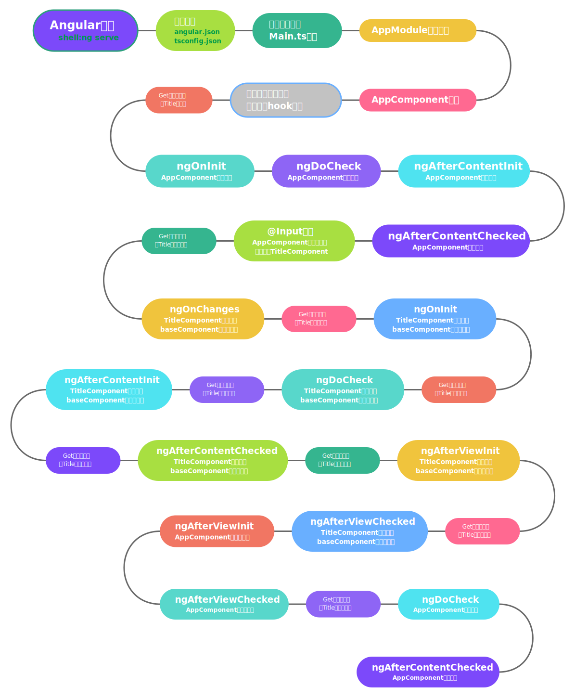

# Angular生命周期演示

这一个分支演示的是 Angular的生命周期在参与了 @Input指令传递变量， 组件类继承后的执行表现

## 先看一张截图

从图上可以看到有三个constructor进行了构造， 并且伴随着input传递以及生命周期的设定执行。
## 三个组件分别如下
### AppComponent[@Component]
 AppComponent 根组件公开属性title 
### TitleComponent[@Component]
 title组件是通过模板关联为AppComponent的子组件的，并且将title变量通过@Input传递给Title组件
### BaseComponent[@Directive]
是TitleComponent类通过extends关键字继承的类, 并且TitleComponent和BaseComponent俩个均实现了全部的生命周期hook接口

## 总结一张图

[线上编辑](https://stackblitz.com/edit/angular-ivy-rwtsnz)
