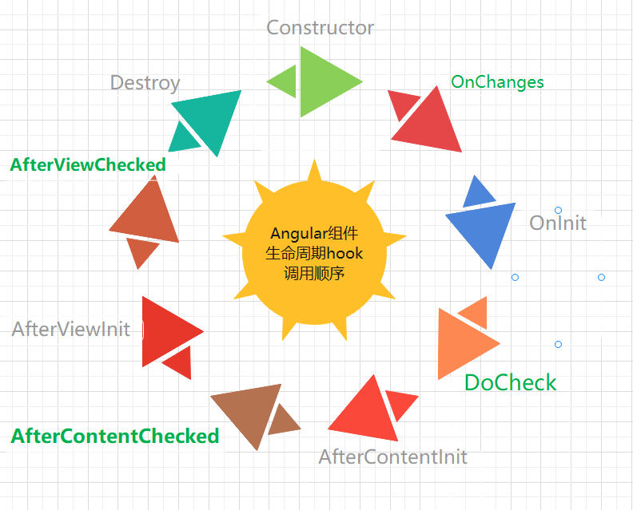

# Angular生命周期演示

这个项目演示的是 Angular的生命周期的基础舒心以及在参与了 @Input指令传递变量， 组件类继承后的执行表现

## 先看截图
### 截图一
注意：**具体实现请参考项目代码**

### 截图二
@input指令参与生命周期的具体位置

### 截图三
child Component组件 参与生命周期后的执行顺序

### 截图四
inherit Component组件 参与生命周期后的执行顺序

从上述几个截图中可以看到有三个constructor参与了构造， 并且伴随着input传递以及生命周期的设定执行。
## 三个组件分别如下
### AppComponent[@Component]
 AppComponent 根组件公开属性title 
### TitleComponent[@Component]
 title组件是通过模板关联为AppComponent的子组件的，并且将title变量通过@Input传递给Title组件
### BaseComponent[@Directive]
是TitleComponent类通过extends关键字继承的类, 并且TitleComponent和BaseComponent俩个均实现了全部的生命周期hook接口

## 总结一张图

[线上编辑](https://stackblitz.com/edit/angular-ivy-rwtsnz)
